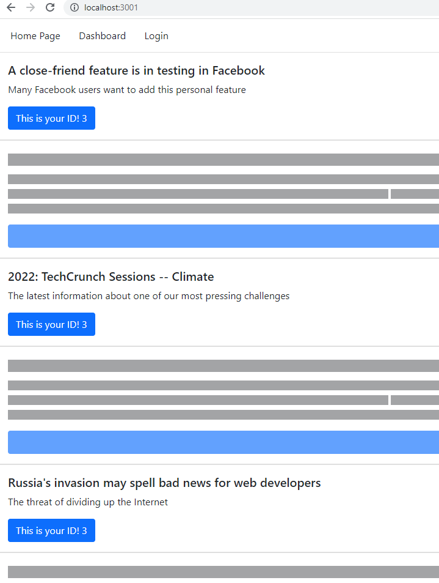

# The Tech Blog
## Table of Contents
[description](#description)
[installation](#installation)
[license](#license)
[usage](#usage)
[contribution](#contribution)
[questions](#questions) 

## Special Note
This application is under development.
## Description 
This is a place where web developers can read and write about technical topins, new technical technologies, and other technical advances.  Here, users can publish posts as well as comment on other web developers' posts. 
## Badges

## Installation
This full stack application can be copied and installed with care to keeping its folder structure.  
## License
MIT
## Usage
This full stack application utilizes the Model-View-Controller (MVC) paradigm and Handlebars.js as the templating language, Sequelize for Object Relational Mapping (ORM), and express-session npm for authentication.
## Contribution
Todd Trulock helped me identify resources to use in this application.  Abdullah Al Hilfi provided me help with debugging this application.
## Questions 
###   GitHub Username:  cnc500
###   GitHub Repository:  theTechBlog
###   Email:  cncarnevale@gmail.com
## Deployed (URL)
https://gentle-reef-32699.herokuapp.com/
## Screenshot
